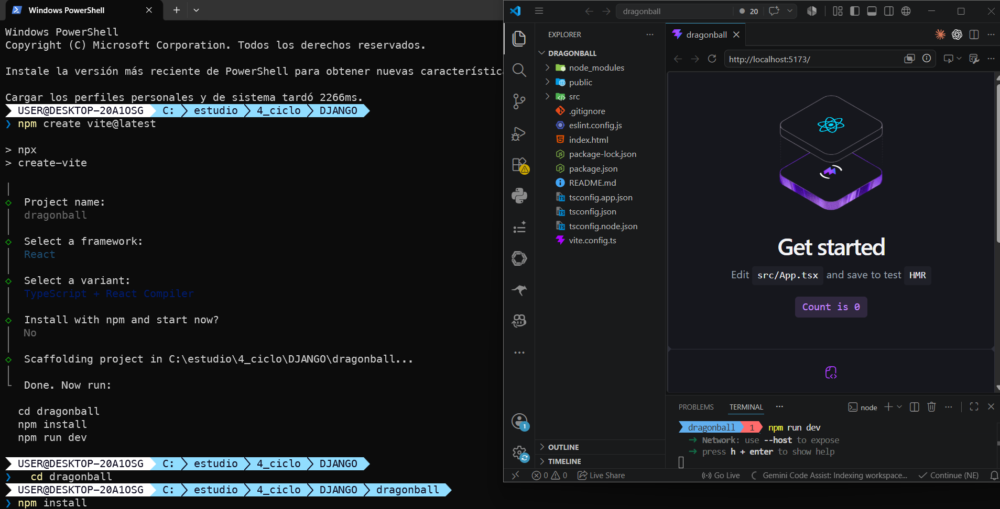
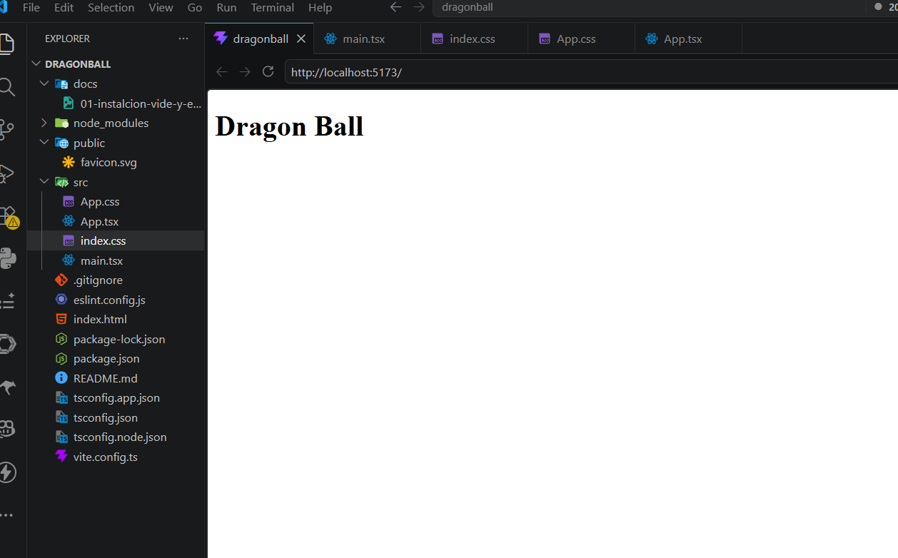
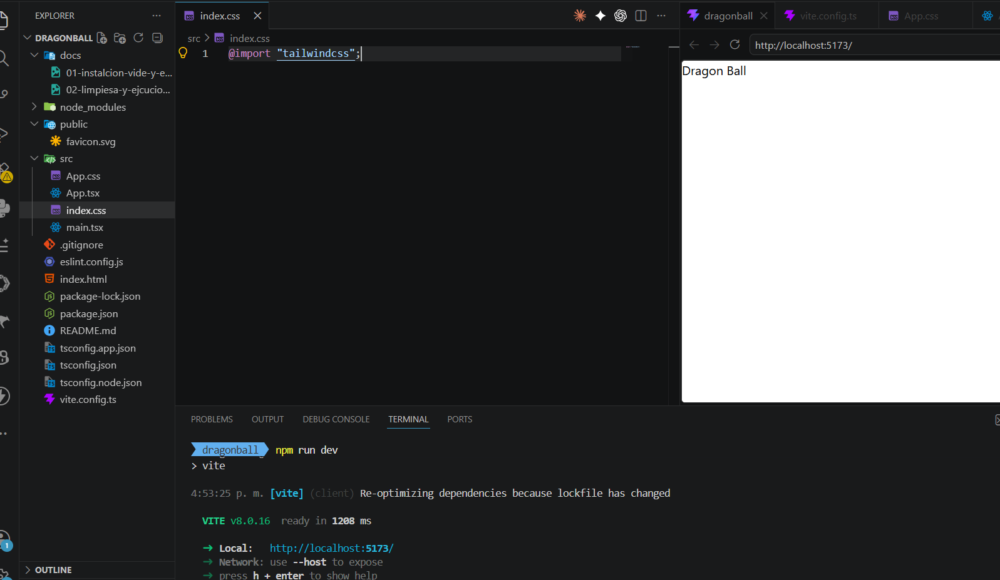
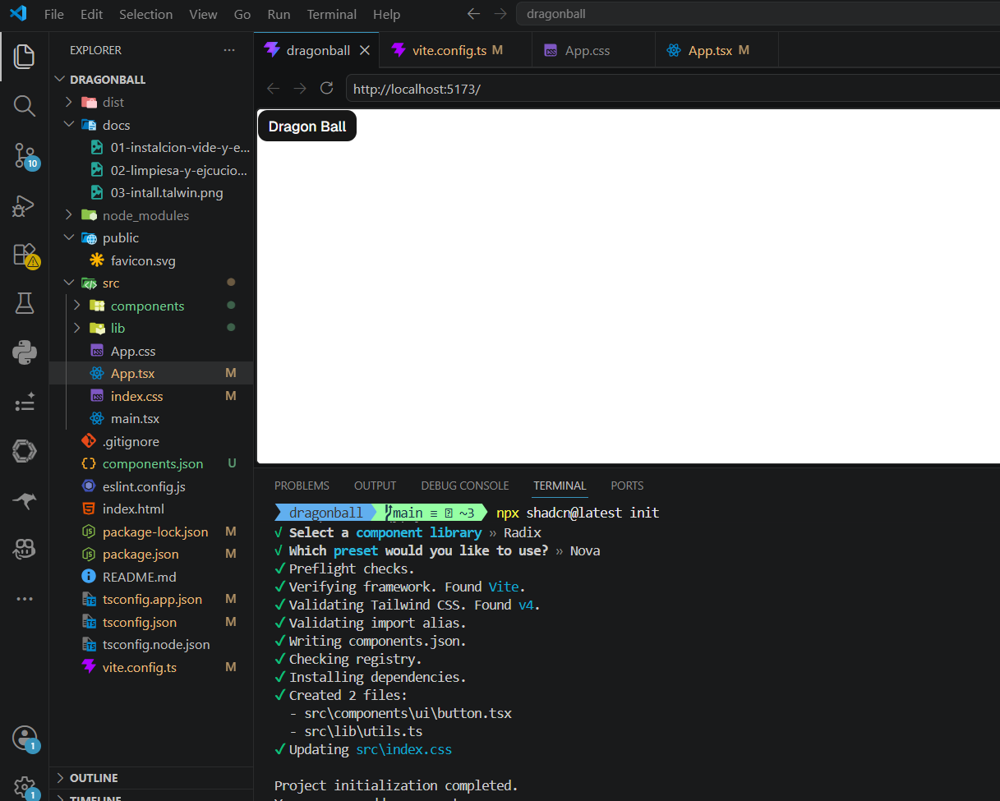
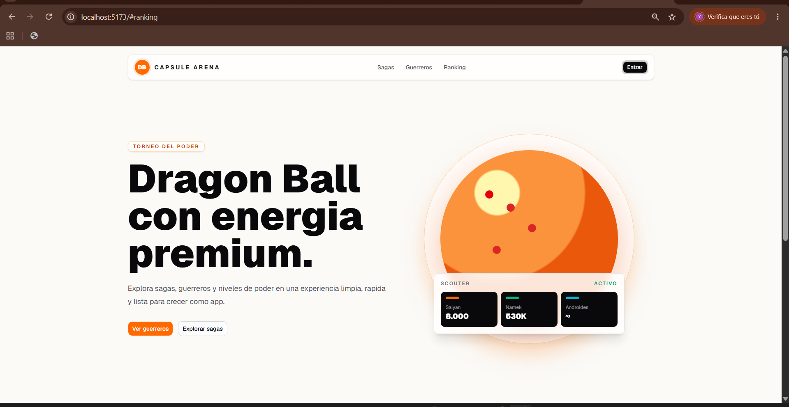
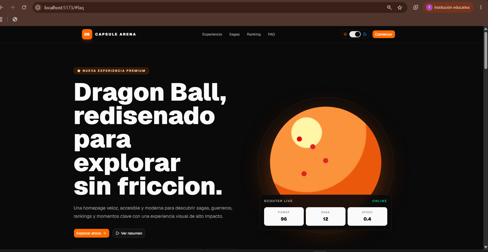

# Capsule Arena - Dragon Ball Landing Page

Landing page moderna inspirada en Dragon Ball, construida con React, TypeScript, Vite, Tailwind CSS, Shadcn/UI y Framer Motion.

El proyecto presenta una homepage premium, responsive y con modo claro/oscuro. Incluye hero section, tarjetas interactivas, estadisticas, tabs, ranking, testimonios, FAQ, CTA final y componentes reutilizables.

## Tecnologias

- React 19
- TypeScript
- Vite
- Tailwind CSS
- Shadcn/UI
- Radix UI
- Framer Motion
- Lucide React

## Instalacion

```bash
npm install
```

## Ejecucion

```bash
npm run dev
```

## Build de produccion

```bash
npm run build
```

## Vista previa del build

```bash
npm run preview
```

## Estructura principal

```txt
src/
  components/
    home/
    ui/
  data/
  lib/
  App.tsx
  main.tsx
```

## Capturas del proceso

### 1. Instalacion de Vite y ejecucion



### 2. Limpieza inicial y ejecucion



### 3. Instalacion de Tailwind CSS



### 4. Instalacion de Shadcn/UI



### 5. Primera landing page



### 6. Refactor final



## Funcionalidades

- Landing page responsive para movil, tablet y escritorio.
- Componentes separados por responsabilidad.
- Modo claro y oscuro persistente.
- Animaciones suaves con Framer Motion.
- Navegacion responsive con menu lateral.
- Formulario CTA funcional con feedback visual.
- SEO basico configurado en `index.html`.

## Scripts disponibles

```bash
npm run dev
npm run build
npm run preview
npm run lint
```

## Autor

Proyecto desarrollado como practica de React, TypeScript, Tailwind CSS y Shadcn/UI.
